# Harness Engineering

**Your coding agent's tests pass. The bug still ships.**

This kit shows why in one command, and gives you small, checkable controls around any AI coding agent: what it may touch, what "done" must prove, and how the next session picks up honestly.

[](https://github.com/sakti1977/Harness-Engineering/actions/workflows/checks.yml)


[](LICENSE)



## Try it in 10 seconds

Python 3.10+ on Linux, macOS or Windows. No model key, no install, no network.

```sh
git clone https://github.com/sakti1977/Harness-Engineering.git
cd Harness-Engineering
python3 -m examples.astro.demo    # green tests on a broken app, then the checks that catch it
python3 -m examples.gate.demo     # an agent tries to mark its own work done
python3 -m examples.gate.timeout_demo   # a lost response: one run and one record, not four
```

The lab models [Jyotish Coach](https://github.com/sakti1977/astro-coach), a Vedic astrology coaching app I am building:

| Defect | Weak check, green on the broken app | Check that catches it |
| --- | --- | --- |
| "Synced" badge while nothing was stored (real incident) | The save returned synced | Read the profile back; force a failed write |
| Ages a day early behind UTC (real incident) | Age tested in IST only | The eve of the birthday at four UTC offsets |
| Coaching saved against a chart the user just corrected | Coaching generated sequentially | Correct the birth time mid-generation |

The gate demo shows what stops an agent from calling that work done (excerpt):

```text
REFUSED  Agent marks its own work passing
         TRANSITION_NOT_ALLOWED: active -> passing. Allowed from active: blocked, ready_for_verification.
REFUSED  Agent asks for verification
         SCOPE_OUTSIDE_SURFACE app/support/upi.py: Not in expected_surface: amend the scope with a reason, or revert.
REFUSED  Same agent approves its own request
         TRANSITION_NOT_INDEPENDENT: copilot-agent requested verification and cannot approve it
RECORDED Independent verifier approves with evidence
STALE    Next session changes verified code: passing is flagged stale
```

## Does it work?

Early signal, not a benchmark. Twelve agent runs got the same three user reports, with and without the harness, and a hidden grader checked the outcomes ([method and raw data](evals/jyotish/README.md)):

| Model | Hidden checks passed, without → with | Said "all fixed" while a check failed, without → with |
| --- | --- | --- |
| Claude Haiku 4.5 | 4–5 of 6 → 6 of 6 | 2 of 2 runs → 0 of 2 |
| Claude Sonnet | 6 of 6 → 6 of 6 | 0 → 0 |
| Claude Opus | 6 of 6 → 6 of 6 | 0 → 0 |

Every harness run also left a test that catches the race if it comes back (3 of 6 without). The cost was about 1.2× the tokens and 1.4–2.5× the time. Two runs per cell, Claude models only: [the results page](evals/jyotish/results/2026-09-27-claude-pilot.md) lists every limit. Run it with your own agent and send the numbers.

## What's inside

| Control | What it does | Start here |
| --- | --- | --- |
| Proof matrix and verification routes | Every claim names the check that proves it, at the boundary it is about | [proof gaps guide](docs/proof-gaps.md), [routes](docs/verify.md) |
| Transition gate | State changes only through a policy: scope before verification, an independent verifier and evidence for `passing`, a hash-chained audit log | [transitions](docs/transitions.md) |
| Session check | Changed files against the feature's scope, claims against evidence | [checker](docs/checker.md) |
| Handoff gate and Resume Protocol | A checkpoint written from the real repository; a stale one fails instead of misleading the next session | [handoff](docs/handoff.md), [AGENTS.md](AGENTS.md) |
| Authority policy | What an agent may read, write and run, and what actually enforces each rule | [authority](docs/authority.md) |
| Attempt gate | Work with side effects runs once per intent; a timeout is recorded as unknown, not retried; reconcile, an independent operator decision and a kill switch settle it | [attempts](docs/attempts.md) |
| Harness tests | Every gate runs against a named defect and against clean work; a gate without both fails the build | [harness tests](harness-tests/README.md) |

The controls are grouped into five layers (Reach, Power, Ground, Verdict, Carry). That grouping is this project's own synthesis, not an industry standard. The checker never runs your code: it reads files and git.

## Adopt it in your project

```sh
python3 scripts/harness_adopt.py --root /path/to/project            # preview; writes nothing
python3 scripts/harness_adopt.py --root /path/to/project --apply    # create missing files; never overwrites
```

This sets up a first feature to fill in, the contracts, instructions for Claude Code, Codex, Copilot, Gemini CLI or Cursor, and optionally a CI workflow. Your project can be in any language. [Adoption guide](docs/adoption.md).

## Why this exists

I lead engineering teams building US healthcare software, and I use coding agents on my own projects. On a 1-on-1 coaching app for managers, my Copilot changes took one to two hours each and landed about 60% of the time. The model was not the problem; the environment around it was. With these controls, a typical change took 10 to 15 minutes and landed about 95% of the time. Those are my observations on one project, not a benchmark; the evaluation above is the first step toward one.

## Learn more

- [Handbook](docs/handbook/00%20-%20Start%20Here/Harness%20Engineering%20-%20MOC.md) and [learning path](docs/handbook/00%20-%20Start%20Here/Learning%20Path.md). These are study notes, also usable as an Obsidian vault in `vault/`.
- [Changelog](CHANGELOG.md), [roadmap](docs/roadmap.md), [contributing](CONTRIBUTING.md) (including the full local check list), [security scope](SECURITY.md).

## Tell me what broke

Run the demo, adopt it on a real project, and [open an issue](https://github.com/sakti1977/Harness-Engineering/issues/new/choose) with where you got stuck, what the checks missed, or an agent failure this kit does not catch yet. Independent results are worth more than anything else here. If it helped, a star helps other engineers find it.

Code and original documentation: [MIT](LICENSE). Linked external sources keep their own terms.
